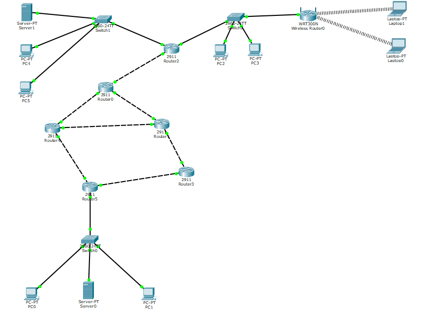

# vpn-gre-tunnel

## Main idea

 
  

1. Implement a network topology consisting of 6 2911 routers.

2. Set the addresses for the network interfaces of the routers from the table below.

<table>
  <thead>
    <tr>
      <th>Router number</th>
      <th>Network address</th>
    </tr>
   </thead>
   <tbody>
     <tr>
       <td>1</td>
       <td>16.112.30.96/27</td>
     </tr>
     <tr>
       <td>2</td>
       <td>38.90.78.0/24</td>
     </tr>
     <tr>
       <td>3</td>
       <td>68.160.48.0/22</td>
     </tr>
     <tr>
       <td>4</td>
       <td>122.154.71.192/27</td>
     </tr>
     <tr>
       <td>5</td>
       <td>138.120.16.0/20</td>
     </tr>
     <tr>
       <td>6</td>
       <td>147.45.0.0/16</td>
     </tr>
     <tr>
      <td>7</td>
      <td>162.113.64.0/19</td>
    </tr>
  </tbody>
</table>

3. Set up routing between networks, ensuring the reachability of all through dynamic routing using the RIP protocol. Assign passive-interfaces accordingly.

4. To the two routers Ri and Rj that are the most remote in topology,
to plug:

    * to Ri – SW1 switch (Cisco 2960);
    * to Rj – switches SW2 and SW3. (Cisco 2960).

On the SW1 switch, organize a private local area network Net1, consisting of the Server PT1 server and several nodes. Assign static addresses to hosts and router interface on this network from the 192.168.128.0/24 range.

5. On the router Ri, to which the Net1 network with the Server PT1 server is connected, configure static NAT for the server. As a global (white) address, take an address that is not the address of the physical interface of the router in the external global network.

6. On the switch SW2, organize three virtual local networks VLAN 1 (vlan by default), VLAN 2 and VLAN 3. In VLAN 2, enable the wireless router
Linksys-WRT300N and configure it:

    * SSID
    * Password to connect
    * WPA2-Personal security mode;
    * Enable automatic channel detection.

Connect three wireless devices to the wireless router, one of which is Server PT2. To assign addresses to wireless network nodes, configure a DHCP server on the wireless router. Select addresses from the range 192.168.128.0/24. Configure the HTTP service on Server PT2. Configure port forwarding (forwarding) on the wireless router to access Server PT2 via HTTP protocol from any external network node.

7. Enable two wired devices in VLAN 3. Set up a trunk link between the switch and the router. Configure subinterfaces for all VLANs on the router. To address subinterfaces, use the range 172.16.128.0/24.

8. On any of the routers, except for the one to which switch SW2 is connected, configure a DHCP server that will distribute addresses to nodes in VLAN 3. Configure DHCP relay on intermediate routers.

9. On Server PT1, configure HTTP, DNS and FTP services.

10. On SW3, organize a private local network Net2, consisting of Server PT3 with a configured HTTP service and several nodes and assign static addresses to nodes and a gateway from the range 10.10.128.0/24. Between two private networks Net1 and Net2, organize a VPN GRE tunnel, for which you need to make the necessary settings on the corresponding routers. For routing in the tunnel, use dynamic routing using the RIP protocol. For tunnel addresses, use addresses in the private range 192.168.127.0/30.

11. On the corresponding router, configure an extended access list that will prohibit wired network devices from accessing HTTP protocol, and access to the Net2 network.

Check network health and service support at any point in the internetwork, including a VPN tunnel between two private networks.

